











<table>
<tr>
<td width="50%"><a href="https://github.com/AHMAD-0702/Superior---University---Gold"></a></td>
<td width="50%"><a href="https://github.com/AHMAD-0702/50--Days--OF--Machine--Learning"></a></td>
</tr>
<tr>
<td width="50%"><a href="https://github.com/AHMAD-0702/Skillyfyzone---Intern"></a></td>
<td width="50%"><a href="https://github.com/AHMAD-0702/Organ---Donation---System"></a></td>
</tr>
<tr>
<td width="50%"><a href="https://github.com/AHMAD-0702/Typing---Speed---Test--Game"></a></td>
<td width="50%" align="center"></td>
</tr>
</table>



